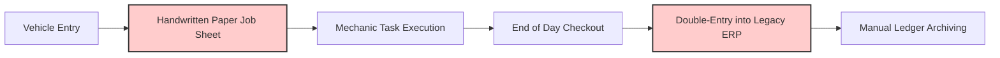
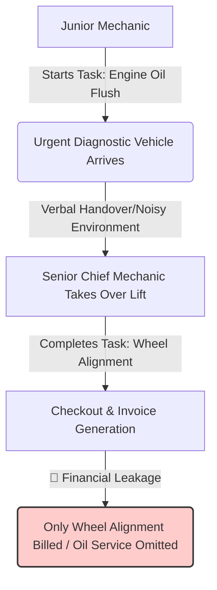

<div align="center">


[](https://git.io/typing-svg)

[](https://hits.seeyoufarm.com)

</div>

<br/>

## 🛠️ Tech Stack & Environment

<div align="center">
  
  **Frontend** <br/>
  
  
  <br/><br/>
  
  **Backend & AI** <br/>
  
  
  
  
  <br/><br/>

  **Database & DevOps** <br/>
  
  
  
  
  
</div>

<br/>

---

## 🚀 Project Overview

**SHC (Smart Handling for Cars)** is a high-integrity, enterprise-grade distributed solution engineered to digitalize, streamline, and secure the daily operations of **Sihwa Car**, a prominent automotive workshop with a 35-year legacy. 

By replacing error-prone handwritten paper sheets and redundant legacy ERP data entries with a state-of-the-art **Progressive Web App (PWA)** and a highly secure **Microservices Architecture (MSA)**, SHC ensures complete transaction safety, financial integrity, and real-time synchronization across all mechanic platforms.

---

## 📖 The Business Context & Motivation

For over three decades, the workshop operated on an analog, paper-first model. This operational flow caused major efficiency bottlenecks and critical financial data drops.

### 🔴 Legacy Operational Workflow


* **Redundant Labor:** Mechanics spent valuable hours transcribing greasy, damaged paper invoices into a rigid legacy ERP system at the end of every business day, leading to operational fatigue.
* **Financial Leakage:** The lack of an atomic state synchronization mechanism led to forgotten billings, cash tracking errors, and total reliance on "gut-feeling" inventory and forecasting decisions.

### 🟢 The Engineered Solution
We engineered a highly transactional distributed system using **Java Spring Boot** (for core business logic and transactional integrity) and **Python FastAPI** (for asynchronous AI OCR vision processing), ensuring an automated, frictionless data flow from vehicle entrance to final customer checkout.

---

## 🎯 Real-World Problems & Technical Solutions

### 1️⃣ Problem A: Mechanic Handover & Context Loss
> **Eliminating communication gaps and billing omissions during high-pressure mechanic task transitions.**



* **Operational Bottleneck:** Due to chaotic workshop conditions, verbal handovers are rarely 100% complete. If a junior mechanic completed the oil change but the chief only billed the final wheel alignment, the oil service was entirely omitted from the invoice.
* **Engineered Solution:** Designed a **stateful, mobile-optimized Real-Time Lift Dashboard**. During a personnel switch, the mechanic performs a single-tap "Handover" on their device. All marked tasks remain permanently accumulated in the active database session, guaranteeing **100% billing accuracy**.

### 2️⃣ Problem B: Cash Integrity & Moral Hazard Prevention
> **Preventing internal financial leakages using systemic lockouts in a cashier-less environment.**

* **Operational Bottleneck:** Cash payments posed a severe moral hazard in a fast-paced, cashier-less workshop environment.
* **Engineered Solution:** Implemented a robust **Dual-Lock Cash Approval System** directly into the database state machine. When `CASH` is selected, the specific lift is immediately locked (`🚨 PENDING OWNER APPROVAL`). The physical lift cannot be cleared for the next vehicle until the shop administrator securely authorizes the release.

### 3️⃣ Problem C: From "Gut-Feeling" to Data-Driven Decisions
> **Transitioning from experience-based scheduling to time-series forecasting.**

* **Engineered Solution:** Built a **Time-Series Business Intelligence Engine** on top of our PostgreSQL schema to analyze historical maintenance against local climate indices (forecasting seasonal parts demand) and automatically generate CRM targeted marketing lists to optimize off-peak labor availability.

---

## 🏗️ System Architecture

SHC adopts a highly decoupled **Microservices Architecture (MSA)** to separate transactional business processing from heavy, vision-based AI computations.

```
                               ┌────────────────────────────────┐
                               │  Client: Progressive Web App   │
                               │    (React / Tailwind CSS)      │
                               └───────────────┬────────────────┘
                                               │
                       ┌───────────────────────┴───────────────────────┐
                       ▼ (REST JSON / HTTPS)                           ▼ (Image Binary / HTTPS)
           ┌───────────────────────┐                       ┌───────────────────────┐
           │   Java Spring Boot    │                       │    Python FastAPI     │
           │ (Core Transaction API)│                       │ (AI / OCR Gateway)    │
           └───────────┬───────────┘                       └───────────┬───────────┘
                       │                                               │
          ┌────────────┴────────────┐                                  ▼
          ▼                         ▼                        ┌───────────────────┐
  ┌───────────────┐         ┌───────────────┐                │    OpenAI API     │
  │  PostgreSQL   │         │    AWS S3     │                │   (gpt-4o-mini)   │
  │ (Supabase DB) │         │(Asset Bucket) │                └───────────────────┘
  └───────────────┘         └───────────────┘
```

---

## 💾 Database Schema (PostgreSQL DDL)

Strict relational schema implemented to enforce business constraints and guarantee financial transactional safety.

<details>
<summary><b>💡 Click to view core Database Schema</b></summary>

```sql
-- 1. Users & Mechanics Directory
CREATE TABLE users (
    id SERIAL PRIMARY KEY,
    username VARCHAR(50) UNIQUE NOT NULL,
    password_hash VARCHAR(255) NOT NULL,
    name VARCHAR(20) NOT NULL,
    role VARCHAR(20) DEFAULT 'MECHANIC'
);

-- 3. Active Work Orders (Lift Fleet Status)
CREATE TABLE work_orders (
    id SERIAL PRIMARY KEY,
    lift_number INT NOT NULL CHECK (lift_number BETWEEN 1 AND 4),
    car_number VARCHAR(20) NOT NULL,
    status VARCHAR(20) DEFAULT 'WORKING',
    payment_method VARCHAR(20), 
    is_approved_by_owner BOOLEAN DEFAULT FALSE, -- Dual-Lock Lockout
    created_at TIMESTAMP WITH TIME ZONE DEFAULT NOW()
);
```
</details>

---

## 🐳 Local Setup & DevOps Pipeline

### 1️⃣ Local Execution (Docker Compose)
Create a `.env` file with `DATABASE_URL` and `OPENAI_API_KEY`, then run:
```bash
docker-compose up -d --build
```
* **Frontend Web App:** `http://localhost:3000`
* **Core Spring Boot API:** `http://localhost:8080/swagger-ui.html`

### 2️⃣ Enterprise DevOps CI/CD Pipeline
Automated testing and zero-downtime deployment via **GitHub Actions**:
`[ Git Push ] ──► [ Lint & Test ] ──► [ Multi-Stage Docker Build ] ──► [ Push to Registry ] ──► [ Secure AWS SSH Deploy & Zero-Downtime Hot Reload ]`
